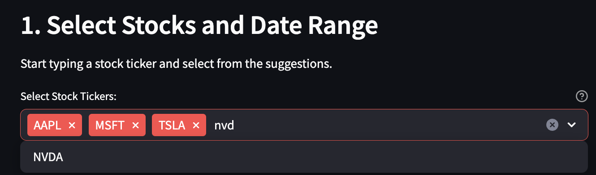
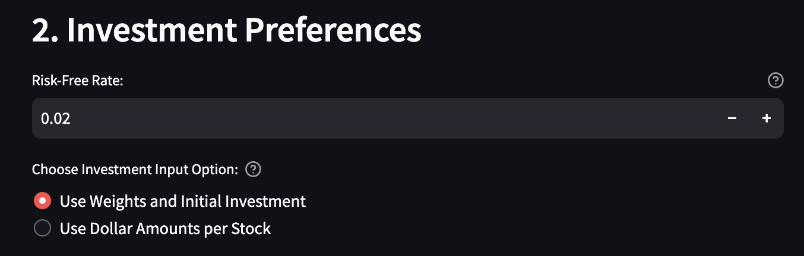
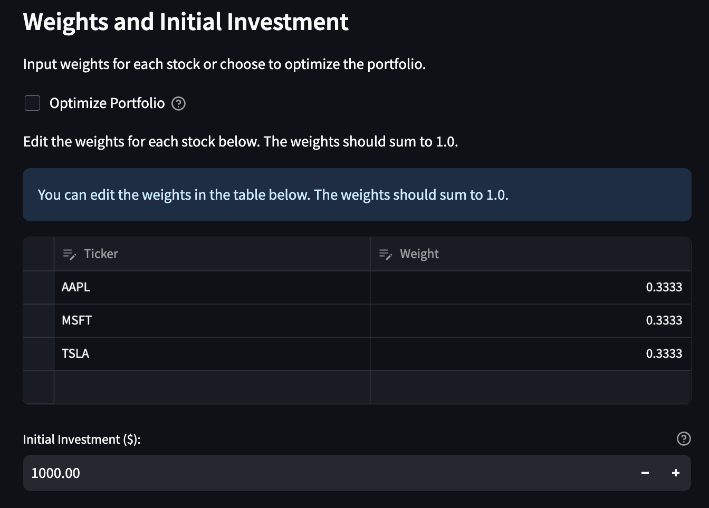
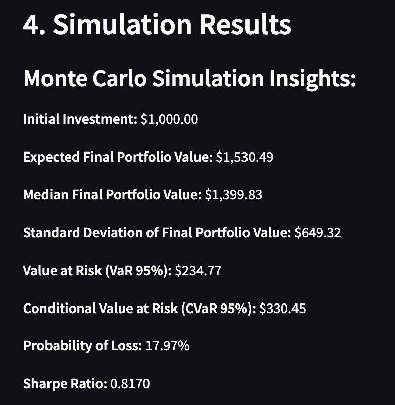
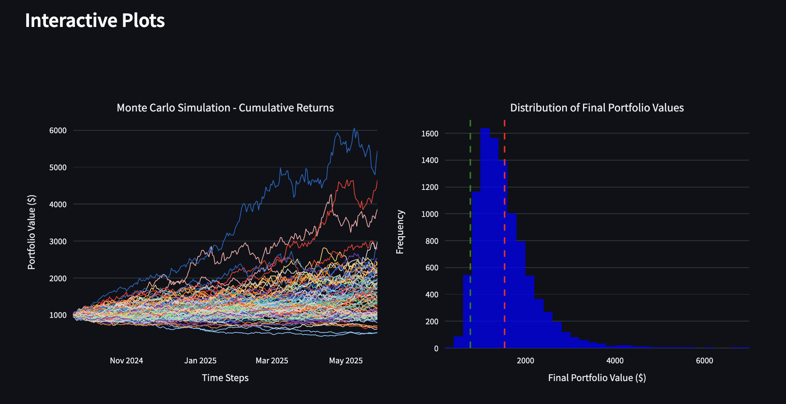

# Portfolio Management with Monte Carlo Simulation

[](https://www.python.org/downloads/)
[](LICENSE)

---

## Table of Contents

- [Portfolio Management with Monte Carlo Simulation](#portfolio-management-with-monte-carlo-simulation)
  - [Table of Contents](#table-of-contents)
  - [Introduction](#introduction)
  - [Features](#features)
  - [Screenshots](#screenshots)
  - [Project Structure](#project-structure)
  - [Installation](#installation)
    - [Prerequisites](#prerequisites)
    - [Setup Instructions](#setup-instructions)
  - [Usage](#usage)
    - [Running the Application](#running-the-application)
    - [Application Workflow](#application-workflow)
  - [Testing](#testing)
  - [Contributing](#contributing)
  - [License](#license)
  - [Contact](#contact)

---

## Introduction

**Portfolio Management with Monte Carlo Simulation** is a comprehensive Python application designed to assist investors and financial analysts in managing and optimizing investment portfolios. By leveraging Monte Carlo simulations and interactive visualizations, the application provides probabilistic forecasts of portfolio performance under various market conditions, aiding in risk assessment and strategic planning.

---

## Features

- **Interactive User Interface**: Streamlit-based UI with intuitive layout and interactive elements.
- **Investment Input Options**:
  - Input weights with an initial investment amount.
  - **OR** specify the actual dollar amount for each stock.
- **Editable Weights Table**: Adjust weights for each stock directly in an interactive table.
- **Portfolio Optimization**: Choose to optimize the portfolio to maximize Sharpe Ratio or achieve a balanced portfolio.
- **Monte Carlo Simulation**: Execute extensive simulations to model future portfolio behavior.
- **Interactive Plots**: Dynamic, interactive charts using Plotly for enhanced data exploration.
- **Performance Metrics**: Calculation of expected returns, volatility, Value at Risk (VaR), and other key financial indicators.
- **Ticker Suggestions**: Autocomplete feature for selecting stock tickers.
- **Explanatory Tooltips**: Hover over info icons to get explanations of input fields.

---

## Screenshots

1. **Main Interface with Ticker Selection**

   

   *Description*: The main interface showing the ticker selection with autocomplete suggestions.

2. **Investment Preferences**

   

   *Description*: Users can choose between entering weights with initial investment or specifying dollar amounts per stock.

3. **Editable Weights Table**

   

   *Description*: An interactive table where users can input and adjust weights for each stock. The default weights are equal.

4. **Simulation Parameters**

   

   *Description*: Set the number of simulations, time horizon, and risk-free rate.

5. **Simulation Results**

   

   *Description*: The application displays simulation insights and interactive plots after running the Monte Carlo simulation.

6. **Interactive Plots**

   

   *Description*: Interactive charts showing cumulative returns and distribution of final portfolio values.

---

## Project Structure

```
portfolio_management/
├── README.md
├── requirements.txt
├── setup.py
├── .gitignore
├── LICENSE
├── app.py                    # Streamlit application
├── portfolio_management/
│   ├── __init__.py
│   ├── data/
│   │   ├── __init__.py
│   │   └── data_loader.py
│   ├── monte_carlo/
│   │   ├── __init__.py
│   │   └── simulation.py
│   ├── portfolio/
│   │   ├── __init__.py
│   │   ├── portfolio.py
│   │   └── optimizer.py
│   └── utils/
│       ├── __init__.py
│       └── helpers.py
└── tests/
    ├── __init__.py
    ├── test_data_loader.py
    ├── test_portfolio.py
    ├── test_simulation.py
    └── test_optimizer.py
```

---

## Installation

### Prerequisites

- **Python 3.7 or higher**: Ensure Python is installed on your system.
- **pip**: Python package installer.
- **Git**: For cloning the repository (alternatively, you can download the ZIP file).

### Setup Instructions

1. **Clone the Repository**

   ```bash
   git clone https://github.com/yourusername/portfolio_management.git
   ```

2. **Navigate to the Project Directory**

   ```bash
   cd portfolio_management
   ```

3. **Create a Virtual Environment** (Recommended)

   ```bash
   python -m venv venv
   ```

   - Activate the virtual environment:

     - **Windows**:

       ```bash
       venv\Scripts\activate
       ```

     - **macOS/Linux**:

       ```bash
       source venv/bin/activate
       ```

4. **Install Dependencies**

   ```bash
   pip install -r requirements.txt
   ```

---

## Usage

### Running the Application

Run the Streamlit app from the terminal:

```bash
streamlit run app.py
```

This will launch the application in your default web browser.

### Application Workflow

1. **Select Stocks and Date Range**:

   - Use the **Select Stock Tickers** field to search and add stock tickers.
   - Start typing a ticker symbol, and suggestions will appear.
   - Select tickers to add them to your portfolio.
   - Choose the start and end dates for historical data.

2. **Investment Preferences**:

   - **Investment Input Option**: Choose between:
     - **Use Weights and Initial Investment**
     - **Use Dollar Amounts per Stock**
   - Depending on your choice:
     - **Weights and Initial Investment**:
       - **Editable Weights Table**: Adjust weights for each stock in the interactive table.
         - The default weights are equal.
         - Ensure that the total weights sum up to 1.0.
       - **Optimize Portfolio**: Optionally, choose to optimize the portfolio.
         - **Optimization Strategy**: Select between maximizing the Sharpe Ratio or a balanced portfolio.
       - **Initial Investment**: Enter the total amount to invest.
     - **Dollar Amounts per Stock**:
       - Input the dollar amount you wish to invest in each stock.
       - The application calculates the weights based on these amounts.

3. **Simulation Parameters**:

   - Set the number of simulations.
   - Set the time horizon in days.
   - Adjust the risk-free rate if necessary.

4. **Run Simulation**:

   - Click on the **"Run Monte Carlo Simulation"** button.

5. **View Results**:

   - **Simulation Insights**: Key metrics from the Monte Carlo simulation.
   - **Interactive Plots**: Explore the cumulative returns and distribution of final portfolio values using interactive charts.

---

## Testing

Run the unit tests to verify the integrity of each module:

```bash
python -m unittest discover -s tests
```

---

## Contributing

Contributions are highly appreciated! Please follow these guidelines:

1. **Fork the Repository**: Click on the 'Fork' button at the top right corner of the repository page.

2. **Create a New Branch**:

   ```bash
   git checkout -b feature/YourFeature
   ```

3. **Commit Your Changes**:

   ```bash
   git commit -am 'Add a feature'
   ```

4. **Push to the Branch**:

   ```bash
   git push origin feature/YourFeature
   ```

5. **Open a Pull Request**: Navigate to your forked repository and click on 'New Pull Request'.

---

## License

This project is licensed under the terms of the [MIT License](LICENSE).

---

## Contact

- **Author**: Your Name
- **Email**: [cristianleo120@gmail.com](mailto:cristianleo120@gmail.com)
- **GitHub**: [cristianleoo](https://github.com/cristianleoo)
- **LinkedIn**: [cristian-leo](https://www.linkedin.com/in/cristian-leo/)
- **Medium**: [cristianleo120](https://medium.com/@cristianleo120)

Feel free to reach out for any inquiries or collaboration opportunities.

---

*Disclaimer: This application is intended for educational purposes only. Investment involves risk, and past performance is not indicative of future results. Consult with a qualified financial advisor before making investment decisions.*
